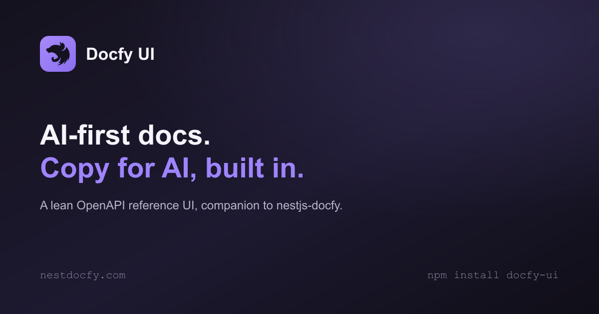

<p align="center">
  
</p>

[](https://github.com/MarvinRF/docfy-ui/actions/workflows/ci.yml)
[](https://www.npmjs.com/package/docfy-ui)
[](https://www.npmjs.com/package/docfy-ui)
[](https://github.com/MarvinRF/docfy-ui/commits/main)
[](https://github.com/MarvinRF/docfy-ui/issues)
[](https://github.com/MarvinRF/docfy-ui/blob/main/LICENSE)

AI-first OpenAPI documentation UI, a companion project to [nestjs-docfy](https://www.npmjs.com/package/nestjs-docfy). A lean, modern API reference UI with a **"Copy for AI"** button on every endpoint: a one-click, pre-formatted text representation optimized for pasting into an LLM prompt, instead of dumping raw OpenAPI JSON or full HTML.

📖 **[Full documentation](https://www.nestdocfy.com/)**

## Table of contents

- [Motivation](#motivation)
- [Features](#features)
- [Installation](#installation)
- [Quick start](#quick-start)
  - [Serving from the same NestJS app as the API](#serving-from-the-same-nestjs-app-as-the-api)
  - [Pointing at a remote spec](#pointing-at-a-remote-spec)
- [Configuration](#configuration)
- [Copy for AI](#copy-for-ai)
- [Try it out](#try-it-out)
- [Deep-linking into a schema](#deep-linking-into-a-schema)
- [Favorites and recently viewed](#favorites-and-recently-viewed)
- [Guides](#guides)
- [Document Model](#document-model)
- [Theming](#theming)
- [Architecture notes](#architecture-notes)
- [Scripts](#scripts)
- [Testing](#testing)
- [License](#license)

## Motivation

Most OpenAPI UIs are built for humans skimming a page. That's the wrong shape for the other audience that reads documentation today: an LLM you're pasting context into. Copying an endpoint's details usually means grabbing raw JSON (verbose, full of `$ref`s and noise) or copy-pasting rendered HTML (loses structure entirely).

**Before**: feeding an LLM a copy of the raw OpenAPI fragment.

```json
{
  "post": {
    "operationId": "createUser",
    "requestBody": {
      "content": {
        "application/json": {
          "schema": { "$ref": "#/components/schemas/CreateUserDto" }
        }
      }
    },
    "responses": {
      "201": { "$ref": "#/components/responses/UserCreated" },
      "400": { "description": "Bad Request" }
    }
  }
}
```

**After**: one click of "Copy for AI" on the same endpoint.

```text
## Create a user
POST /users

### Request
{
  "name": "string",
  "email": "string"
}

### Responses
201 Created — UserEntity
400 Bad Request

### Validation
- name: required, minLength 2
- email: required, format email
```

`docfy-ui` renders that text deterministically from the same OpenAPI document any Swagger UI already serves, no extra annotations, no backend changes.

## Features

- **Copy for AI**: every endpoint gets a one-click, LLM-ready plain-text summary (purpose, request, responses, validation rules) instead of raw JSON.
- **Copy OpenAPI**: copies the dereferenced, cycle-safe JSON fragment for just the selected endpoint.
- **Copy MCP Reference**: copies the endpoint's method/path plus the current page URL, so an agent with access to the live app (or an MCP server pointed at it) can look the operation up directly instead of you pasting the whole spec.
- **Try it out**: execute a real request against the API from the browser, with auth support (apiKey/bearer/basic/OAuth2 token), a "Live" response tab, a **"Copy as curl"** button that reproduces the exact request (real typed values and resolved auth, not placeholders), and a **schema match badge** that validates the live response against its declared schema — see [Try it out](#try-it-out).
- **Compare specs**: diff two OpenAPI documents and flag breaking vs. informational changes (new/removed endpoints, newly-required params, removed response codes).
- **Multi-spec switcher**: browse more than one service's documentation from a single deployed instance, without leaving the UI.
- **Guides**: narrative markdown pages (onboarding, tutorials) rendered alongside the generated API reference, listed in the sidebar — see [Guides](#guides).
- **Two-column endpoint view**: documentation on the left (parameters, responses, navigable schema tree), code snippets (curl, JavaScript fetch, Axios, Python, PHP) on the right. Every request body / response has an **Example** and a **Schema** tab; deep-link straight into a nested property with a URL hash (e.g. `#response-200/address/city`) — see [Deep-linking into a schema](#deep-linking-into-a-schema).
- **Real-time search**: filters the sidebar by path/summary/operationId on every keystroke, no debounce, no Enter key.
- **Favorites and recently viewed**: star any endpoint to pin it in the sidebar, and the last 5 you opened show up in a "Recent" section automatically — both scoped per spec and persisted to `localStorage` — see [Favorites and recently viewed](#favorites-and-recently-viewed).
- **Dark/light theme**: token-driven, switches instantly with no page reload and no flash on first paint.
- **Zero backend coupling**: fetches a plain OpenAPI 3.0/3.1 JSON document client-side; works with any server that exposes one, not just NestJS.
- **Mobile-responsive**: off-canvas sidebar drawer below the `lg` breakpoint, audited at 375/390/768px.

## Installation

```bash
npm install docfy-ui
```

This package ships a pre-built static bundle (`dist/`); there is no server-side code to install on a Node backend. If you're using [`nestjs-docfy`](https://www.npmjs.com/package/nestjs-docfy), its `DocfyUiModule.setup()` already wraps this for you (see below); otherwise, serve the `dist/` folder with any static file server.

## Quick start

### Serving from the same NestJS app as the API

The simplest setup if your backend is NestJS: let `nestjs-docfy` mount this package for you.

```ts
import { NestFactory } from '@nestjs/core';
import { SwaggerModule, DocumentBuilder } from '@nestjs/swagger';
import { DocfyUiModule } from 'nestjs-docfy';

const app = await NestFactory.create(AppModule);

DocfyUiModule.setup('/docs', app); // before SwaggerModule.setup

const document = SwaggerModule.createDocument(app, new DocumentBuilder().build());
SwaggerModule.setup('api', app, document); // exposes /api-json, which docfy-ui fetches by default

await app.listen(3000);
```

Visit `/docs`: no further configuration needed, since `docfy-ui` fetches `/api-json` same-origin by default.

### Pointing at a remote spec

Without `nestjs-docfy`, build and serve the static assets yourself and point them at any OpenAPI document: same-origin convention or an explicit URL.

```bash
npm run build   # in this package, or use the prebuilt dist/ from npm
```

Serve `dist/` with any static host (NestJS's `ServeStaticModule`, Nginx, S3 + CloudFront, etc.) alongside or in front of the API that exposes the spec.

## Configuration

The UI has no build-time configuration. It resolves the spec to render entirely at runtime, via one rule with one override:

| Source                        | When                                                                                           | Example                                                                     |
| ----------------------------- | ---------------------------------------------------------------------------------------------- | --------------------------------------------------------------------------- |
| `GET /api-json` (same-origin) | Default: matches what `@nestjs/swagger`'s `SwaggerModule.setup()` exposes alongside Swagger UI | `https://api.example.com/docs` → fetches `https://api.example.com/api-json` |
| `?spec=<url>` query param     | Takes precedence over the default when present                                                 | `https://docs.example.com/?spec=https://api.example.com/api-json`           |

If the UI is deployed on a different origin than the API, use the `?spec=` override and make sure the API's CORS configuration allows that origin to `GET` the JSON document.

This same origin question comes up again for [Try it out](#try-it-out)'s request execution — see that section for how the same-origin proxy sidesteps it without touching the API's own CORS config.

## Copy for AI

`operationToAiText(endpoint)` (`src/transformers/copy-for-ai.ts`) is a pure function (no I/O, no React) that turns a normalized endpoint into the plain-text block behind the "Copy for AI" button, structured as: Purpose → Request → Responses → Error Responses → Validation. Edge cases are handled explicitly rather than guessed at:

- No `requestBody` → no Request section.
- No declared `4xx`/`5xx` → no Error Responses section.
- `oneOf`/`anyOf` schemas → annotated as `(one of N possible shapes)` instead of picking one arbitrarily.
- A schema with no constraints → no Validation section.
- A long description with no `summary` → truncated to two sentences for Purpose.

Generation is consistently well under 100ms (no spinner is ever shown) and recursive/circular DTOs are handled safely. See [Document Model](#document-model).

## Try it out

Every endpoint's request panel has a **Code / Try it out** mode switch, next to the language tabs. "Code" is the snippet view described above; "Try it out" is an editable form (base URL, path/query/header params, request body) that executes a real request via `executeRequest()` (`src/transformers/execute-request.ts`) and shows the result in a "Live" tab alongside the declared example responses — pretty-printed when the body is JSON, with a friendly message instead of a raw error on a network/CORS failure.

- **Base URL**: defaults to the first entry in the OpenAPI document's `servers[]` array when present, falling back to the page's own origin otherwise. Always freely editable.
- **Authentication**: endpoints with a `security` requirement get an inline auth form (`AuthPanel`) — one input per declared scheme. `apiKey` goes to a header or query param per its `in`; `http bearer`/`oauth2`/`openIdConnect` all accept a token you paste in directly (no OAuth dance is performed); `http basic` expects `user:pass`. Credentials are global (shared across every endpoint using that scheme, like a real dev token) and persist to `localStorage` so they survive a reload.
- **"Use as … token"**: when a successful Live response contains a token-shaped field (e.g. a login endpoint's `access_token`, including nested under an envelope like `data.access_token`), a button lets you reuse it as the Bearer credential for the rest of the session with one click — no manual copy/paste.
- **Copy as curl**: sits next to "Send" — builds the exact `curl` command "Try it out" is about to fire, sharing `buildRequestUrl()`/`applyAuth()` with the real request so the two can never drift apart. Unlike the static "Code" tab snippets (which use placeholder `name=type` tokens and never see auth), this reflects whatever you actually typed into the form.
- **Schema match badge**: on the "Live" tab, when the response status has a declared schema and the body parsed as JSON, a green **"✓ Matches schema"** or red **"⚠ N schema mismatches"** badge appears (hover for each offending path/reason) — via `docfy-core`'s `validateAgainstSchema()`. Catches contract drift (missing/renamed field, wrong type) at request time, not just in CI.
- **CORS**: by default this is a direct `fetch()` from the browser to the target, so it's subject to the target API's own CORS policy — same constraint as [Configuration](#configuration) above. When `nestjs-docfy`'s `DocfyUiModule.setup()` is configured with `openApiDocument` (see [its README](https://github.com/MarvinRF/nest-docfy#docfyuimodulesetupmountpath-app-options)), `docfy-ui` detects the injected `window.__DOCFY_PROXY_PATH__` and routes the request through a same-origin server-side proxy instead, sidestepping CORS entirely for whatever origins the OpenAPI document declares in `servers[]`.

Out of scope, deliberately: request history, multiple named environments, a full OAuth2 authorization-code/PKCE flow, and cookie-based auth (can't be set reliably cross-site from the browser).

## Deep-linking into a schema

Every request body and response has an **Example** tab (the type-token JSON payload) and a **Schema** tab (`SchemaTree` — the navigable, expandable/collapsible property tree, `src/components/SchemaTree.tsx`). A URL hash on an endpoint page points straight at a nested property in one of them:

```text
/{tag}/{operationId}#response-200/address/city
/{tag}/{operationId}#request-body/items/sku
```

- `scope` is `response-<status>` or `request-body`; the rest of the hash is the property-key chain from the schema root, one segment per level (URL-encoded).
- Opening a URL with a matching hash auto-opens the right response card (or the request body section), switches it to the **Schema** tab, expands every ancestor of the target property, and scrolls to it with a brief highlight.
- Built from `schemaToTreeNodes()`'s `path: string[]` on each `SchemaTreeNode` (the raw property-key chain, independent of the `[]` display suffix used for arrays) and the pure helpers in `src/document-model/schema-anchor.ts` (`buildSchemaAnchorHash`/`parseSchemaAnchorHash`/`buildSchemaAnchorId`).
- Every row in the Schema tree also has a hover "copy link" button (`SchemaTree.tsx`) that copies the absolute URL — origin + path + the hash above — for that exact property, ready to paste into Slack/a PR comment/an agent prompt.

## Favorites and recently viewed

The sidebar tracks endpoint usage per spec (keyed by the loaded spec URL, so switching specs via the multi-spec switcher doesn't mix unrelated APIs):

- **Favorites** — hover any endpoint row (in the tag tree, or in Favorites/Recent themselves) to reveal a star toggle; starred endpoints get pinned in a "Favorites" section at the top of the sidebar, in the order you starred them.
- **Recently viewed** — the last 5 distinct endpoints you opened, most-recent-first, shown in a "Recent" section below Favorites. An endpoint already in Favorites is left out of Recent to avoid showing it twice.

Both persist to `localStorage` (`useNavigationStore`, `src/state/navigation-store.ts`) and survive a reload. Recording a visit happens automatically in `EndpointRoute` on navigation — no action needed beyond opening an endpoint.

## Guides

Narrative markdown pages — onboarding, tutorials, anything that isn't "here's an endpoint" — rendered at `/guides/:slug` and listed in the sidebar above the endpoint tag tree. `docfy-ui` doesn't own the content; `nestjs-docfy`'s `DocfyUiModule.setup({ guides })` injects it (see [its README](https://github.com/MarvinRF/nest-docfy#docfyuimodulesetupmountpath-app-options)):

```ts
DocfyUiModule.setup('/docs', app, {
  guides: [
    {
      slug: 'getting-started',
      title: 'Getting Started',
      content: fs.readFileSync('./guides/getting-started.md', 'utf8'),
    },
  ],
});
```

Rendered via [`react-markdown`](https://github.com/remarkjs/react-markdown) + [`remark-gfm`](https://github.com/remarkjs/remark-gfm) (tables, strikethrough, task lists) — no `@tailwindcss/typography` plugin, element styles are hand-mapped to this app's own design tokens instead. Fenced code blocks render through the same `CodeBlock` component used everywhere else (consistent styling, no second syntax highlighter). No guides configured → the sidebar section and `/guides/*` routes simply don't exist, zero visual change.

### Embedded Try it out (`docfy-try` blocks)

A guide can embed a live, runnable request for any endpoint in the current spec — not just a link to its page. Use a fenced code block with the `docfy-try` language tag, containing a single `METHOD /path` line matching an endpoint exactly (same path template as the OpenAPI doc, e.g. `/users/{id}`):

````markdown
```docfy-try
POST /auth/login
```
````

Renders the same `RequestPanel` (Code/Try it out tabs, real auth, real request execution) used on the endpoint's own page, inline in the guide. No fuzzy matching: a typo'd method or path renders a small inline error instead of guessing, so broken references are obvious while writing the guide rather than failing silently.

## Document Model

Before anything reaches a component, the raw OpenAPI document is normalized into an in-memory model (`tagGroups → endpoints`), implemented as pure, independently tested TypeScript with no React dependency:

- `src/document-model/normalize.ts`: dereferences every `$ref` via `@apidevtools/swagger-parser` and groups endpoints by tag, preserving declared order.
- `src/document-model/cap-depth.ts`: makes a dereferenced (and possibly cyclic, for recursive DTOs) schema safe to `JSON.stringify` for the "Copy OpenAPI" button.
- `src/document-model/example.ts` / `schema-tree.ts`: build the type-token example payload and the navigable schema tree from the same schema, without fabricating fake data.
- `src/document-model/filter.ts`: the client-side search used by the sidebar.

All schema-walking functions (`flattenSchema`, `schemaToTreeNodes`, `extractValidationRules`) track visited nodes by object identity rather than a numeric depth cap, so a genuinely recursive DTO renders a single `(circular reference)` / `↩ circular` marker instead of unrolling N times or crashing.

## Theming

Dark/light theming is token-driven and reload-free:

- `src/styles/tokens.ts`: `getThemeTokens(theme)` / `deriveSurfaceTokens(bg, text)`, a small fixed set of base tokens (background, text, accent) plus derived surface/border tokens, obtained by mixing `bg` toward `text` and never introducing a new hue.
- `src/styles/apply-theme.ts`: writes the resulting CSS custom properties and `data-theme` onto `<html>`; switching themes only changes variable values, no re-render of the component tree is required.
- `src/state/theme-store.ts`: a Zustand store that persists the chosen theme to `localStorage` and applies it synchronously before first paint (no flash of the wrong theme).

## Architecture notes

- **Browser-only by design**: the document model and "Copy for AI"/"Copy OpenAPI" transformers run entirely client-side; the UI has no server component beyond the static bundle.
- **`@apidevtools/swagger-parser` over `@readme/openapi-parser`**: chosen for a smaller bundle, a working `browser` field, and equivalent OpenAPI 3.1 support (`src/__tests__/parser-spike.spec.ts` records this as a regression-protecting test). Its transitive dependency `@apidevtools/json-schema-ref-parser` calls `Buffer.isBuffer()` unconditionally, which throws in a real browser. Worked around with a minimal `buffer` polyfill imported first in `src/main.tsx` (`src/polyfills.ts`).
- **Verified against real OpenAPI 3.0 and 3.1 documents** (`public/sample-spec.json`, `public/sample-spec-31.json`), exercising `oneOf`/`anyOf`, a no-`requestBody` endpoint, an endpoint with no declared error responses, an unconstrained schema, and a long multi-sentence description. Driven by Playwright against real Chrome, at desktop and mobile (375/390/768px) widths.
- **Route-level code-splitting**: `GuidePage` and `ComparePage` are loaded via `React.lazy`, not bundled eagerly (`Shell.tsx`). Both pull real weight — `GuidePage` drags in `react-markdown`/`remark-gfm`, `ComparePage` the diff engine — and neither is where most sessions land first, unlike the endpoint detail view. A session that never opens a guide or the compare view skips that JS entirely.

## Scripts

```bash
npm run dev         # start the Vite dev server
npm run build        # typecheck + production build
npm run preview      # preview the production build
npm test             # run the test suite (vitest)
npm run typecheck
```

## Testing

```bash
npm test
```

The suite (Vitest + Testing Library) covers the document model, transformers, hooks, and every component, queried by role/text/label rather than implementation details, so visual changes don't require rewriting tests.

## License

[MIT](https://github.com/MarvinRF/docfy-ui/blob/main/LICENSE) © Marvin Rocha
